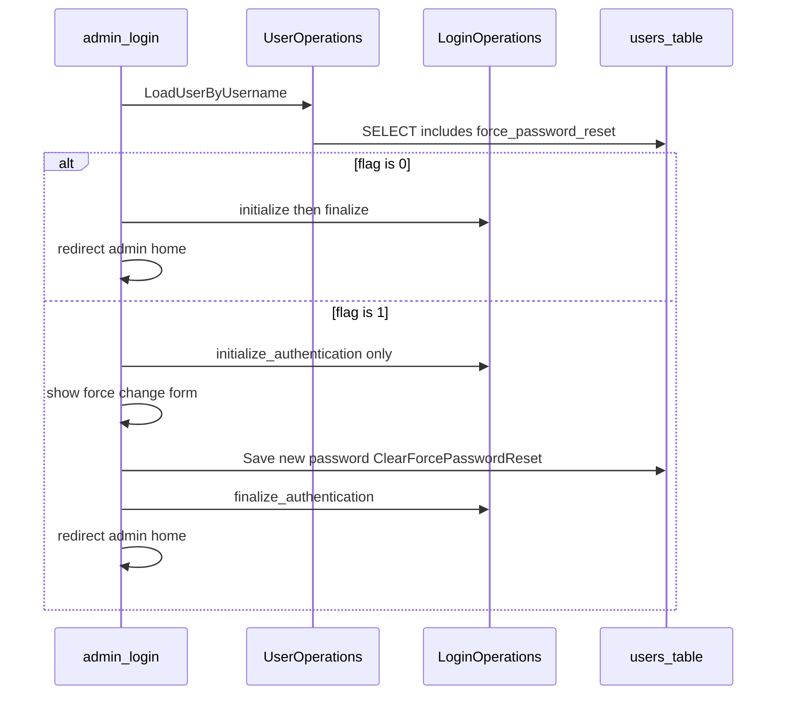

# Force password reset for backend users (CMSMS fork)

This file is the **project-local mirror** of the implementation plan for [Force Password Reset BackEnd Users #18](https://github.com/cmsmadesimple/cmsmadesimple/issues/18). **Canonical plan (editor):** `/root/.cursor/plans/force_password_reset_cmsms_27ddd4f6.plan.md` — keep this `to-do` copy aligned when the plan changes.

Paths below are relative to this repository root (`cmsmadesimple/`).

## Deployment status (01/05/2026)

Implemented in `cmsmadesimple` and deployed to **live** [newstargeted.com/public_html](https://newstargeted.com). Database migration: run once `php sql/apply_force_password_reset_schema_203.php` from `public_html` (already executed on live). `CMS_SCHEMA_VERSION` is **203**. Protect `sql/` with `sql/.htaccess` (Require all denied).

## Goal

Match the feature described in the issue: after credentials verify, users with a forced flag must set a new password before receiving a full admin session; admins can set/clear the flag; modules can react via a core hook.

## Current behaviour (relevant code)

- Login: [admin/login.php](../admin/login.php) loads the user with `UserOperations::LoadUserByUsername` in [lib/classes/class.useroperations.inc.php](../lib/classes/class.useroperations.inc.php), runs `Core::LoginPre`, then `LoginOperations::initialize_authentication` / `Core::LoginVerified` in [lib/classes/internal/class.LoginOperations.php](../lib/classes/internal/class.LoginOperations.php), then `finalize_authentication` (which sets `cms_loggedin` and session cookie material). `get_userid()` in [lib/functions/page.functions.php](../lib/functions/page.functions.php) only resolves once `finalize_authentication` has run, so **skipping `finalize` keeps the user out of the admin UI**, which is what you want for a forced reset gate.
- Password change patterns already exist on the same page for **lost password** (`recoverme` / `forgotpwchangeform` branches in [admin/login.php](../admin/login.php)); mirror that UX for **forced reset** (dedicated POST action + template section), reusing `SetPassword` / `Save` on [lib/classes/class.user.inc.php](../lib/classes/class.user.inc.php).
- User persistence: `InsertUser` / `UpdateUser` and `LoadUserByID` in [lib/classes/class.useroperations.inc.php](../lib/classes/class.useroperations.inc.php) must include the new column everywhere user rows are read or written (including `LoadUsers` / `LoadUsersInGroup` SELECT lists).

## 1. Database

- Add nullable or non-null boolean column on `{CMS_DB_PREFIX}users`, e.g. `force_password_reset TINYINT(1) NOT NULL DEFAULT 0` (MySQL/MariaDB friendly; adjust if you support other drivers CMSMS exposes).
- **Reason string from the issue** (`SetForcePasswordReset($user_id, $reason = '')`): either add `force_password_reset_reason VARCHAR(255) NULL`, or store reason only in the hook/audit log and not in DB (simpler schema). Recommend **DB column** if admins need to see why in the UI later.
- **Schema version**: bump `$CMS_SCHEMA_VERSION` in [lib/version.php](../lib/version.php) after you define how upgrades run. This repo snapshot has **no `.sql` migrations** under the tree; production CMSMS upgrades often come from the installer/upgrader package. For the fork, pick one path and document it: ship a small **upgrade routine** invoked from the same place your distribution applies core DDL (if you have one outside this tree), or ship a **documented one-shot SQL** snippet operators run once when deploying this fork, then bump `{prefix}version` to match `CMS_SCHEMA_VERSION`.

## 2. Model and `UserOperations` API

- Extend [lib/classes/class.user.inc.php](../lib/classes/class.user.inc.php): property (e.g. `force_password_reset`), default in `SetInitialValues()`, and ensure `Save()` path updates the column via `UpdateUser` / `InsertUser`.
- Add to [lib/classes/class.useroperations.inc.php](../lib/classes/class.useroperations.inc.php) (issue names):
  - `SetForcePasswordReset($user_id, $reason = '')` (UPDATE + optional reason + `audit()` + `\CMSMS\HookManager::do_hook('Core::ForcePasswordReset', [...])` with `user_id`, `reason`, `actor_uid` if available).
  - `ClearForcePasswordReset($user_id)` (UPDATE to 0, clear reason).
  - `RequiresPasswordReset($user_id)` (read flag; can use loaded `User` or a cheap `GetOne`).
- **File size**: `class.useroperations.inc.php` is already **514 lines** in the baseline tree used for planning. To respect the 500-line rule, extract the three new methods (and any shared SQL helpers) into a small internal class under `lib/classes/internal/` (e.g. `UserForcePasswordResetHelper.php`) called from `UserOperations`, or split `UserOperations` into include files. Keep public API on `UserOperations` so modules keep a stable entry point.

## 3. Login interception (core of the feature)

- After successful `LoadUserByUsername` and `Core::LoginPre`, if `RequiresPasswordReset` is true:
  - Call `initialize_authentication` so pending-auth timing and session regeneration stay consistent with the rest of the login stack.
  - **Do not** call `finalize_authentication` yet; set Smarty flags for a **forced password change** form (new password + confirm), analogous to the existing lost-password change block in [admin/login.php](../admin/login.php).
- New POST handler on `login.php`: validate `cms_pending_auth_userid` matches the user being changed, enforce same password rules as lost-password flow, `SetPassword`, persist, `ClearForcePasswordReset`, then `finalize_authentication`, `Core::LoginPost`-equivalent ordering (you may also fire a narrow hook like `Core::ForcedPasswordResetComplete` if you want symmetry; the issue only mandates `Core::ForcePasswordReset` on **setting** the flag).
- Respect **300s pending auth expiry** already enforced in `finalize_authentication` in [lib/classes/internal/class.LoginOperations.php](../lib/classes/internal/class.LoginOperations.php): show a clear message if expired and require re-login.
- **Modules that unset `cms_pending_auth_userid`**: existing pattern at [admin/login.php](../admin/login.php) (around lines 205–207) allows a module to block default finalization. Ensure forced-reset logic still runs when appropriate (e.g. check the flag **before** yielding to module finalization, or document module contract).

## 4. Admin UI

- **Per-user toggle**: extend [admin/edituser.php](../admin/edituser.php) + [admin/templates/edituser.tpl](../admin/templates/edituser.tpl): checkbox "Require password change on next login" (only for users the editor may manage; never lock out user id 1 without extra safeguards if that is a policy you want).
- **Quick action** (optional but matches "User Management"): [admin/listusers.php](../admin/listusers.php) GET/POST action calling `SetForcePasswordReset` (prefer **POST** with `CMS_SECURE_PARAM_NAME` for state-changing actions even if older toggles use GET).
- When an admin sets a **new password** in edit user (`$password != ''`), call `ClearForcePasswordReset` automatically so the user is not prompted again immediately.

## 5. Hook and module discoverability

- Fire `\CMSMS\HookManager::do_hook('Core::ForcePasswordReset', [ 'user_id' => ..., 'reason' => ..., 'actor_uid' => ... ])` from `SetForcePasswordReset` (and optionally when cleared, if you want `Core::ForcePasswordResetCleared`).
- Add **English strings** in [admin/lang/en_US.php](../admin/lang/en_US.php) for `event_desc_*` / `event_help_*` if your project registers Core events that way (grep existing `event_desc_edituser*` as a template). [lib/classes/class.HookManager.php](../lib/classes/class.HookManager.php) forwards to legacy `Events::SendEvent` for module handlers.

## 6. Optional integrations (follow-ups, not required for minimal PR)

- Call `SetForcePasswordReset` from brute-force detection modules or from `Core::LoginFailed` handlers (rate-limit logic is not in core today).
- "Reset all backend users" bulk tool for breach response (admin-only, heavy confirmation).

## 7. Testing checklist

- Fresh user: flag off, login unchanged.
- Set flag via edit user: next login shows forced form; after change, flag off and admin works.
- Admin changes password in edit user: flag cleared without forced screen.
- Pending auth > 300s: forced form errors gracefully.
- `LoadUserByID` / `LoadUsers` show correct flag for UI.
- Module handler on `Core::ForcePasswordReset` receives parameters.

## 8. Files to touch (summary)

| Area | Files |
|------|--------|
| DB / version | [lib/version.php](../lib/version.php), migration doc or installer hook you use in your distribution |
| Model / API | [lib/classes/class.user.inc.php](../lib/classes/class.user.inc.php), [lib/classes/class.useroperations.inc.php](../lib/classes/class.useroperations.inc.php), optional new `lib/classes/internal/*.php` |
| Login UX | [admin/login.php](../admin/login.php), login Smarty template under `admin/themes/` (e.g. OneEleven `login.tpl`) |
| Admin UI | [admin/edituser.php](../admin/edituser.php), [admin/templates/edituser.tpl](../admin/templates/edituser.tpl), optionally [admin/listusers.php](../admin/listusers.php) |
| Strings | [admin/lang/en_US.php](../admin/lang/en_US.php) (and other locales if you maintain them) |
